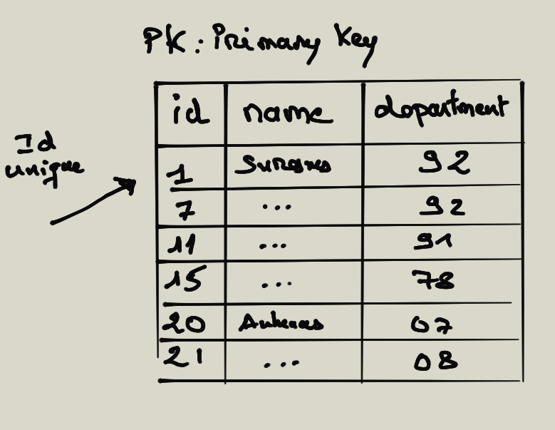
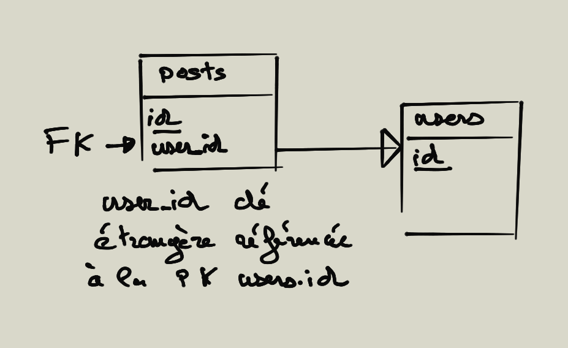

# Création d'une base de données

Nous allons travailler avec MySQL ou MariaDB et surtout avec le modèle relationnel InnoDB.

Il existe plusieurs moteurs de base de données, pour MySQL vous avez : MyISAM, Innodb, Archive, Memory par exemple.

**MyISAM** est un moteur qui ne supporte pas les transactions, mais possède des fonctionnalités de recherche de texte.

**InnoDB** est le moteur qui est le plus utilisé. Il supporte le mode transactionnel et les contraintes référentielles (clés étrangères).

**Memory** est un moteur de stockage dans la mémoire vive : RAM de l'ordinateur. On peut l'utiliser par exemple pour des systèmes de cache pour une application.

## Modèle de données

### Table

Le modèle de données relationnel repose sur des principes théoriques rigoureux (algèbre relationnel). La **table relationnelle** est la structure de données qui contient des lignes (rows) et des colonnes (columns) qui décrivent les enregistrements.

### Les clés

La clé primaire (Primary Key) d'une table est l'ensemble minimal de colonnes qui permet d'identifier **de manière unique** chaque enregistrement. Dans une table d'enregistrement il faut trouver les clés candidates pouvant remplir ce rôle et sinon utiliser un identifiant numérique de type entier auto-incrémenté, souvent nommé **id** pour identifiant de la ligne.

**Attention, il ne peut y avoir qu'une seule clé primaire dans une table relationnel.**



\newpage

### Type de la clé primaire

Une clé primaire est : NOT NULL, UNIQUE et c'est un INDEX.

UNIQUE et NOT NULL se comprennent facilement. Un INDEX pour sa part est une structure supplémentaire dans la base de données, il permet d'ordonner les clés.

## Clé étrangère

La clé étrangère (Foreign Key), elle référence dans la majorité des cas une clé primaire d'une autre table. Il peut y avoir plusieurs clés étrangères dans une même table.



Notons qu'une clé étrangère lorsqu'elle se référence sur une clé primaire d'une autre table possède **EXACTEMENT** le type de la clé primaire référencée.

\newpage

## Base de données

C'est un regroupement logique d'objets comme les tables, index, vues, procédures, ... Stockés sur le disque dur. MySQL définit la notion d'hôte (host) c'est la machine qui héberge le SGDB.

MySQL hébergera vos bases de données et tables, son accès sera également conditionné par un login/password et une adresse ou host.

## Commandes utiles

Pour se connecter avec votre mot de passe à la base de données book :

```bash
# Connexion au serveur
# en tant que root
mysql -u root -p

# une fois sur le serveur
# on se connecte à la base de données
mysql> use book
```

Plus rapidement vous pouvez également taper la ligne suivante dans votre terminale :

```bash
mysql -u root -p --database myDataBase
```

Pour quitter la base de données :

```bash
mysql> quit
```

Pour afficher les commandes disponibles dans MySQL tapez une fois sur le serveur la commande suivante :

```bash
mysql>?
```

## DDL data definition language

Normalement sur vos machines vous devriez avoir MySQL d'installer. 

Si vous souhaitez effectuer cette installation sur votre propre machine téléchargez MySQL à l'adresse suivante : [MySQL](https://dev.mysql.com/downloads/mysql/#downloads)
De nombreux tutos sur le Web vous aiderons dans les démarches d'installation et de configuration. Nous ne l'aborderons pas dans cette partie du cours.

Convention de nommage des tables et base de données, **pas de caractères spéciaux** et **espace**. Par ailleurs, vous pouvez préfixer le nom des bases de données : db_boston, db_titanic. Pour les noms des tables vous pouvez prendre comme convention de nommage des noms au pluriels.

## commandes : CREATE, ALTER, DROP

Pour créer des objets de type base ou table on utilise la commande **CREATE**, pour modifier ou supprimer ces objets on utilise la commande **DROP**.

```sql
CREATE DATABASE IF NOT EXISTS `db_boston` ;

DROP DATABASE `db_boston`;
```

Notez que les cotes couchées permettent d'échapper les caractères des noms des tables, base de données ou colonnes pour ne pas les confondre avec les mots réservés du langage SQL.

## commandes : ALTER ou RENAME (attention RENAME ne fonctionne pas sur toutes les bases de données)

Ces commandes permettent de modifier la structure d'une table :

```sql
-- changer le type de colonne
ALTER TABLE nom_table
MODIFY nom_colonne type_donnees

-- renommer le nom du colonne
ALTER TABLE nom_table
CHANGE colonne_ancien_nom colonne_nouveau_nom type_donnees
```

## Préciser l'encodage lors de la création de la base de données

Préciser le jeu de caractères utiliser lors de la création de la base de données :

Depuis la version 8 de MySQL vous pouvez définir l'encodage utf8mb4 plus étendu :

```sql
CREATE DATABASE IF NOT EXISTS `db_aviation`
CHARACTER SET utf8mb4 COLLATE utf8mb4_unicode_ci;
```

## Création d'une table

Connectez-vous à la base de données db_aviation à l'aide de la commande USE de MySQL, puis exécutez la commande CREATE :

```sql

-- connexion à la base de données

USE db_aviation ;

-- création de la table employees
CREATE TABLE `compagnies` (
    `comp` CHAR(4),
    `street` VARCHAR(20),
    `city` VARCHAR(20) NULL,
    `name` VARCHAR(20) NOT NULL,
    CONSTRAINT pk_compagny PRIMARY KEY (`comp`)
    ) ENGINE=InnoDB ;
```

**CONSTRAINT** permet de nommer la clé primaire.

Une fois cette table créée dans la base de données db_compagnie, tapez la ligne de commande suivante dans mysql, notez le ";" elle termine une commande, tapez entrée pour l'exécuter :

```bash

mysql>describe compagnies;

```

```txt
+--------+-------------+------+-----+---------+-------+
| Field  | Type        | Null | Key | Default | Extra |
+--------+-------------+------+-----+---------+-------+
| comp   | char(4)     | NO   | PRI | NULL    |       |
| street | varchar(20) | YES  |     | NULL    |       |
| city   | varchar(20) | YES  |     | NULL    |       |
| name   | varchar(20) | NO   |     | NULL    |       |
+--------+-------------+------+-----+---------+-------+
```

## Exercice modifier

Modifiez la table compagny ci-dessus et ajoutez le champ status de type ENUM qui prendra les valeurs suivantes : "published", "unpublished", "draft" et qui par défaut aura la valeur "draft".

Ajoutez également la colonne numStreet.

Supprimez cette nouvelle colonne puis recréez la en la plaçant cette fois après la colonne "name" de la table compagnies. Utilisez la commande suivante : AFTER dans la commande ALTER.


## Exercice créer la table pilots

Créez la table pilots suivante dans la base donnes db_aviation.

```text
+-------------+--------------+------+-----+---------+-------+
| Field       | Type         | Null | Key | Default | Extra |
+-------------+--------------+------+-----+---------+-------+
| certificate | varchar(6)   | NO   | PRI | NULL    |       |
| numFlying   | decimal(7,1) | YES  |     | NULL    |       |
| compagny    | char(4)      | YES  | MUL | NULL    |       |
| name        | varchar(20)  | NO   | UNI | NULL    |       |
+-------------+--------------+------+-----+---------+-------+
```

- Essayez de mettre le champ name unique en définissant une contrainte UNIQUE nommée sur ce champ. Utilisez la syntaxe suivante sur la table déjà existante :

```sql
CREATE TABLE `pilots` (
    `certificate` VARCHAR(6),
    `numFlying` DECIMAL(7,1),
    `compagny` CHAR(4),
    `name` VARCHAR(20) NOT NULL,
    CONSTRAINT pk_pilots PRIMARY KEY (`certificate`)
) ENGINE=InnoDB ;
```

- La table pilots possède une clé étrangère pilots.compagny qui se référencera à la clé **comp** de la table compagnies. Ci-dessous voici la définition de cette clé étrangère que vous devez implémenter également dans la table :

```sql
ALTER TABLE pilots ADD CONSTRAINT fk_pilots_compagny_compagnies FOREIGN KEY (compagny) REFERENCES compagnies(`comp`);

```

Notez que la table compagnies existe déjà. En effet, pour que la clé étrangère se référence sur la clé primaire de la table compagnies, il faut qu'elle existe.
